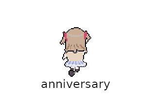

# anniversary - Neuro Bullet Hell Game

Hi! As part of the Neuro Game Jam, I've decided to make a bullet hell game.

The theme was **Remnants of the Past**.

## Credits

If something isn't listed below here, then I'm the one who made it. This includes art, sound, and the programming work.

### Assets

- [BulletUpHell BLAST](https://bottled-up-studio.itch.io/godot-bullethell-plugin/devlog/839720/v456-bug-fixes-optimisation-and-api) for the bullet hell plugin
- [Dialogue Manager for Godot 4](https://github.com/nathanhoad/godot_dialogue_manager) for the dialogue manager
- [Kenny's All-in-One](https://kenney.itch.io/kenney-game-assets) for any placeholder assets, absolutely goated individual
- [The big tree](https://www.vecteezy.com/png/19527064-an-8-bit-retro-styled-pixel-art-illustration-of-an-oak-tree)

### Sounds

I've made these loops myself! Check them out here:

- [Level1](./assets/level1.wav)
- [Level2](./assets/level2.wav)
- [Level3](./assets/level3.wav)
- [Level4](./assets/level4.wav)
- [Level5](./assets/level5.wav)
- [Level6](./assets/level6.wav)
- [Final Song](./assets/finalsong.wav)

They're made with BeepBox, and you can find their raw unedited versions in [MUSIC.md](./MUSIC.md).
